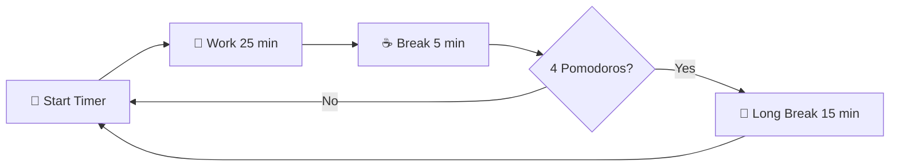

<div align="center">

# 🍅 Pomodoro Timer

### *Stay focused, stay productive, one tomato at a time* 🎯

[
[](https://developer.mozilla.org/en-US/docs/Web/HTML)
[](https://developer.mozilla.org/en-US/docs/Web/CSS)
[](https://developer.mozilla.org/en-US/docs/Web/JavaScript)

[](https://github.com/features/copilot)
[](http://makeapullrequest.com)
[](https://opensource.org/licenses/MIT)


<p align="center">
  <a href="#-features">Features</a> •
  <a href="#-quick-start">Quick Start</a> •
  <a href="#-how-it-works">How It Works</a> •
  <a href="#-tech-stack">Tech Stack</a> •
  <a href="#-contributing">Contributing</a>
</p>

</div>

---

## 🎯 What's This All About?

The **Pomodoro Technique** is a time management method that uses a timer to break work into focused intervals (traditionally 25 minutes) separated by short breaks.  This app brings that classic productivity technique into the modern age with a sleek, user-friendly interface.

> **👨‍💻 Behind the Scenes:** The backend logic and Flask implementation?  That's all human ingenuity.  The gorgeous frontend styling? That's where GitHub Copilot flexed its design muscles.  Together, we're the ultimate human-AI power duo!  🤝✨

---

## ✨ Features

<table>
<tr>
<td width="50%">

### 🎨 **Beautiful Interface**
Clean, modern design that won't distract you from getting things done

### ⚙️ **Customizable Timers**
Set your own work and break durations to match your workflow

### 🔔 **Smart Notifications**
Audio alerts to gently remind you when it's time to switch gears

</td>
<td width="50%">

### 📊 **Session Tracking**
Keep count of completed Pomodoros and watch your productivity soar

### 💾 **Persistent Settings**
Your preferences are saved automatically for next time

### 🚀 **Lightning Fast**
Built with Flask for a smooth, responsive experience

</td>
</tr>
</table>

---

## 🚀 Quick Start

### Prerequisites

```bash
🐍 Python 3.7+
📦 Flask
🌐 A modern web browser
```

### Installation

```bash
# 1️⃣ Clone this beauty
git clone https://github.com/willow788/pomodoro-timer.git

# 2️⃣ Navigate to the project
cd pomodoro-timer

# 3️⃣ Install Flask (if you haven't already)
pip install flask

# 4️⃣ Run the app
python main.py

# 5️⃣ Open your browser and visit
# 🌐 http://localhost:5000
```

<div align="center">

### 🎉 **That's it!  You're ready to be productive! ** 🎉

</div>

---

## 🎮 How It Works

<div align="center">



</div>

### The Classic Pomodoro Flow

1. **🎯 Choose a task** you want to focus on
2. **⏰ Set the timer** to 25 minutes (or your preferred duration)
3. **💪 Work on the task** until the timer rings
4. **✅ Take a short break** (5 minutes) - stretch, grab water, relax! 
5. **🔄 Repeat** steps 2-4
6. **🌴 After 4 Pomodoros**, take a longer break (15-30 minutes)

---

## 🛠️ Tech Stack

<div align="center">

| Layer | Technology |

| **Backend** | 
| **Frontend** |  
| **Styling** |  
| **Logic** | 
| **Design Assistant** | 

</div>

---

## 📁 Project Structure

```
🍅 pomodoro-timer/
│
├── 📄 main.py                  # Flask backend - the brains 🧠
│
├── 📂 templates/
│   └── 📄 index.html          # Main app page - all-in-one powerhouse
│
├── 📂 demonstration/
│   └── 🖼️ pomodoroDemo. png   # Screenshot of the app in action
│
└── 📄 README.md               # You are here!  📍
```

---

## 🎨 Design Philosophy

<table>
<tr>
<td width="50%" align="center">

### 🎯 Simplicity
Minimalist interface that doesn't distract from your work

</td>
<td width="50%" align="center">

### ⚡ Speed
Lightweight and fast - no bloated frameworks

</td>
</tr>
<tr>
<td width="50%" align="center">

### 🎨 Beauty
Copilot-designed styles that are easy on the eyes

</td>
<td width="50%" align="center">

### ♿ Accessibility
Clear typography and intuitive controls

</td>
</tr>
<tr>
<td colspan="2" align="center">

### 📱 Responsive Design
Works great on desktop and mobile devices

</td>
</tr>
</table>

---

## 🤝 Contributing

Found a bug? 🐛 Have a feature idea? 💡 Contributions are **always** welcome! 

<div align="center">

### How to Contribute

```bash
# Fork the repo → Create a branch → Make your changes → Submit a PR
```

</div>

1. 🍴 **Fork** the repository
2. 🌿 **Create** your feature branch (`git checkout -b feature/AmazingFeature`)
3. 💾 **Commit** your changes (`git commit -m 'Add some AmazingFeature'`)
4. 📤 **Push** to the branch (`git push origin feature/AmazingFeature`)
5. 🎉 **Open** a Pull Request

---

## 📈 Roadmap

- [ ] 🌙 Dark mode toggle
- [ ] 📊 Statistics dashboard with graphs
- [ ] 🎵 Custom notification sounds
- [ ] 💾 Task list integration
- [ ] 📱 Progressive Web App (PWA) support
- [ ] ☁️ Cloud sync for settings

---

## 💡 Pro Tips

<div align="center">

| Tip | Why It Matters |
|:----|:---------------|
| **🔕 Silence notifications** | During Pomodoros, turn off Slack, email, everything! |
| **☕ Use breaks wisely** | Stand up, stretch, hydrate - don't doom scroll! |
| **📝 Plan your Pomodoros** | Start each day knowing what you'll tackle |
| **⏱️ Adjust timing** | The 25/5 split isn't law - find what works for YOU |

</div>

---

## 🙏 Acknowledgments

<div align="center">

**Built with** ❤️ **by** [@willow788](https://github.com/willow788)

Special thanks to:
- 🍅 **Francesco Cirillo** for inventing the Pomodoro Technique
- 🤖 **GitHub Copilot** for being an amazing styling partner
- ☕ **Coffee** - the unofficial sponsor of this project
- 🎵 **Lo-fi beats** - for the focus vibes

</div>

---

## 📝 License

This project is open source and available under the **MIT License**. 

---

<div align="center">

### 🌟 If this helped you stay focused, give it a star! 🌟

[](https://github.com/willow788/pomodoro-timer/stargazers)
[](https://github.com/willow788/pomodoro-timer/network/members)

**Made with 🍅, Python 🐍, and a sprinkle of AI magic ✨**

---

*"The secret of getting ahead is getting started."* - Mark Twain

---

**Questions?  Feedback? Just want to say hi?  👋**

📧 Open an issue • 💬 Start a discussion • ⭐ Star the repo

</div>
